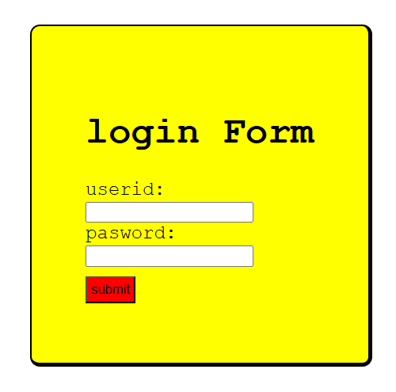

# 🔐 Login Page (HTML + CSS)

A simple and clean login page built using HTML and CSS. Designed for practice and learning purposes.

### 🖼️ Preview

> Make sure you add a screenshot image named `login-preview.png` in a folder called `images`.

> Make sure you add a screenshot image named `login-preview.png` in a folder called `images`
## 📁 Project Structure
